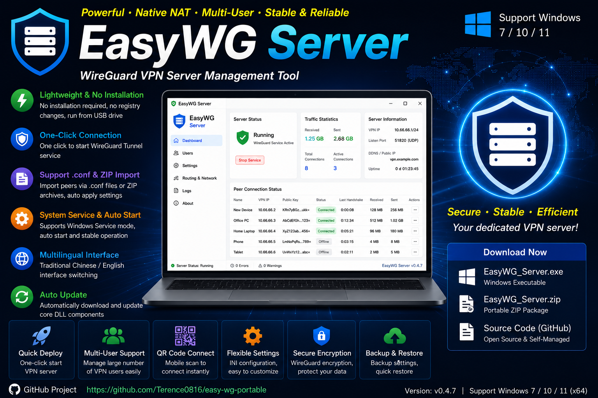
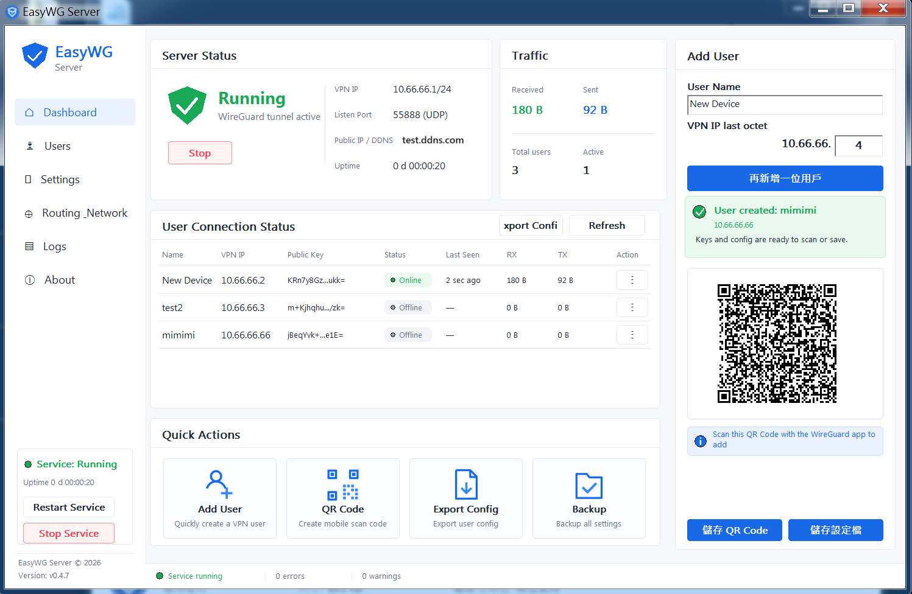
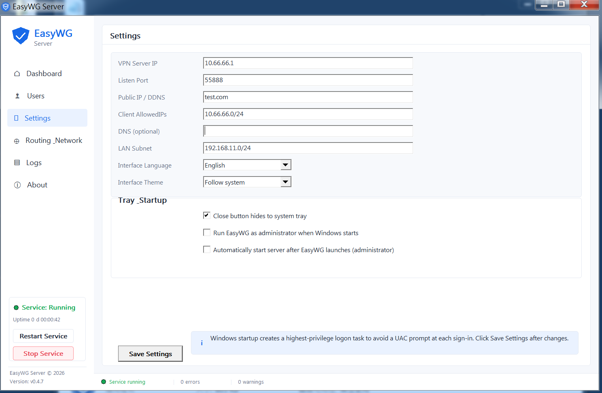
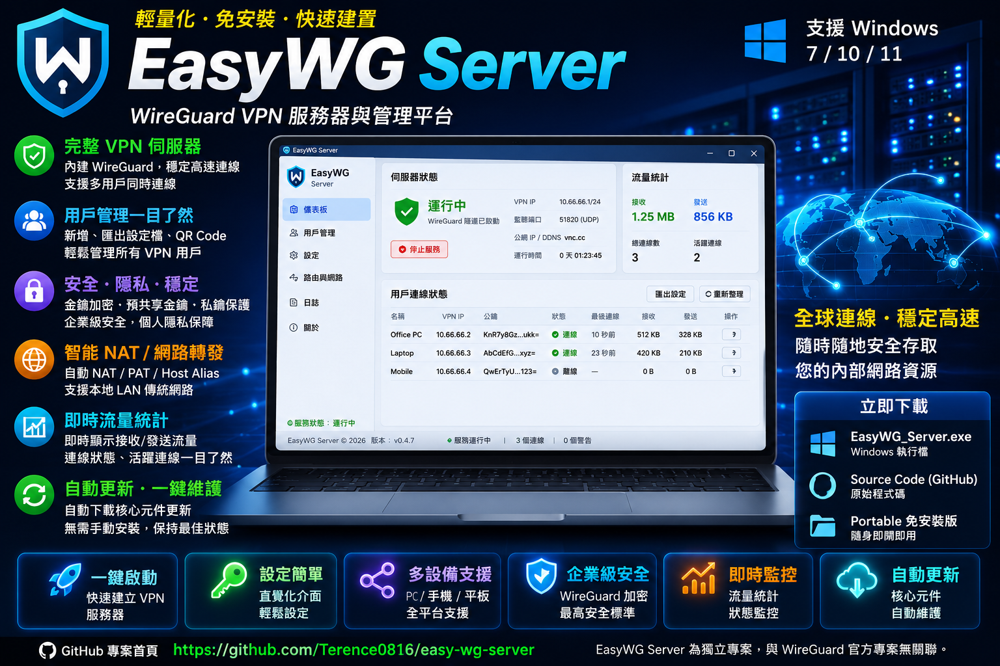
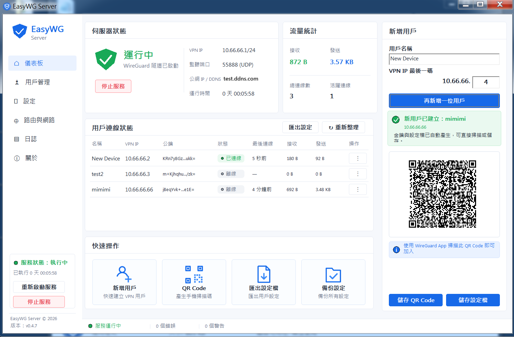
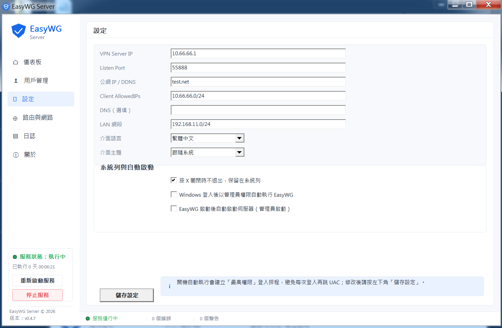

# EasyWG Server

Ultra-lightweight native Windows GUI for creating and managing a WireGuard VPN server.


[Releases](https://github.com/Terence0816/easy-wireguard-server/releases) |
[Latest Official Build `v0.4.7`](https://github.com/Terence0816/easy-wireguard-server/releases/tag/v0.4.7) |
[PolyForm Shield License 1.0.0](./LICENSE)

English | [繁體中文](#繁體中文)



EasyWG Server is a lightweight **native Windows WireGuard VPN server management tool**.

It provides a simple graphical workflow for creating and managing a multi-peer WireGuard VPN server directly on Windows. No Docker, Linux, Hyper-V, or router static routes are required for VPN-to-LAN access.

The main application is written in **native C++ / Win32 x64** and supports **Windows 7 SP1, Windows 10, and Windows 11** through version-specific WireGuard core paths.

> EasyWG Server is an independent, unofficial project and is not affiliated with or endorsed by the WireGuard project.

> This repository is **source-available** under the PolyForm Shield License 1.0.0. See [LICENSE](./LICENSE) for the exact terms.

## Latest Release — v0.4.7

The initial public release provides a complete Windows WireGuard server workflow with multi-peer management, QR Code onboarding, Native NAT/PAT, Host Alias access, Windows 7 Legacy compatibility, and real-time peer statistics.

### Highlights

- Native C++ / Win32 x64 application
- Ultra-lightweight main executable
- Windows 7 SP1 / 10 / 11 x64 support
- Multi-peer / multi-user VPN management
- One-click server start and stop
- Local WireGuard key generation
- Local QR Code generation
- Individual peer `.conf` export
- Peer edit / export / QR Code / delete actions
- Native NAT/PAT for VPN-to-LAN access
- Host Alias NAT for access to the server host's own LAN IP
- No router static route required for LAN access
- Automatic LAN and public network information detection
- Real-time RX / TX traffic statistics
- Peer handshake and online-status display
- Windows 7 Legacy statistics through WireGuard UAPI
- Traditional Chinese / English UI
- Light / Dark / Follow System themes
- System tray resident mode
- Close-to-tray behavior
- Windows logon auto-start through Task Scheduler
- Optional automatic server startup
- Single-instance protection
- Immediate `Starting...` / `Stopping...` UI feedback
- Automatic required runtime component download
- Centralized version management through `ver.txt`
- Windows EXE version metadata and `VERSIONINFO`
- Local key and QR generation for improved privacy

## English Interface

### Dashboard

The dashboard provides a real-time overview of the VPN server, traffic statistics, server information, peer status, handshake time, and per-peer RX / TX usage.



### Settings

The settings page provides server, startup, language, theme, tray, and related application options.



## Windows Core Architecture

EasyWG Server automatically uses the appropriate WireGuard path for the current Windows version.

### Windows 10 / 11

```text
EasyWG_Server.exe
└─ wireguard.dll
```

- Uses the WireGuardNT-based server path
- Native peer configuration
- Native handshake and RX / TX statistics
- Windows 10 / 11 remain on the modern WireGuardNT path

### Windows 7

```text
EasyWG_Server.exe
├─ tunnel-win7.dll
├─ wintun.dll
├─ WinDivert.dll
└─ WinDivert64.sys
```

- Uses a Legacy WireGuard userspace / Wintun compatibility path
- Uses WireGuard UAPI for peer handshake and RX / TX statistics
- Uses the Windows 7-compatible runtime path automatically
- WinDivert `2.2.0-C` is used for the Windows 7 compatibility path

> Windows 7 SP1 x64 with working TLS 1.2 system updates is recommended.

## Native LAN Access

EasyWG Server includes a native Windows NAT design for VPN-to-LAN access.

### Other LAN Hosts

```text
VPN Client
   ↓
Native NAT/PAT
   ↓
LAN Host
```

Example:

```text
10.66.66.2
   ↓
192.168.11.100
```

### EasyWG Server Host LAN IP

The EasyWG Server computer's own LAN IP is handled separately through Host Alias NAT.

```text
VPN Client
   ↓
Host Alias NAT
   ↓
EasyWG Server LAN IP
```

Example:

```text
10.66.66.2
   ↓
192.168.11.69
```

This architecture allows VPN clients to access:

- Other LAN computers
- SMB / Windows file sharing
- TCP services
- UDP services
- The EasyWG Server host's own LAN IP

No router static route is required for this LAN access workflow.

## Multi-Peer Management

Each peer can have its own:

- Name
- VPN IP
- Private Key
- Public Key
- Preshared Key
- Exported `.conf` configuration
- Locally generated QR Code

Available peer actions include:

- Edit
- Export configuration
- Show QR Code
- Delete

## Local QR Code Generation

QR Codes are generated locally inside EasyWG Server.

WireGuard configuration data is not sent to an external QR Code API.

This is useful for quickly adding phones, tablets, laptops, and other WireGuard clients.

## How to Use

1. Download the latest `EasyWG_Server.exe` from the [Releases](https://github.com/Terence0816/easy-wireguard-server/releases) page.
2. Run `EasyWG_Server.exe`.
3. Allow Administrator privileges when requested.
4. On first launch, missing runtime components are obtained automatically when required.
5. Configure the VPN subnet, UDP listen port, and public IP / DDNS information.
6. Add a new peer.
7. Scan the generated QR Code with the WireGuard mobile app, or export the peer `.conf` file.
8. Start the server.
9. For Internet access, forward the configured UDP listen port from your router to the EasyWG Server LAN IP.

## External Internet Access

For connections from outside your LAN:

```text
Internet
   ↓
Router UDP Port Forward
   ↓
EasyWG Server
```

Forward the configured WireGuard UDP listen port to the LAN IP of the EasyWG Server computer.

Example:

```text
UDP 51820
   ↓
192.168.11.69:51820
```

A public IP address or DDNS hostname can be used in exported peer configurations.

## Peer Online Status

WireGuard uses UDP and does not provide a TCP-style connected / disconnected session state.

EasyWG Server therefore estimates peer online status from the most recent WireGuard handshake.

This means a peer may remain shown as connected for a short period after the client app is closed or the network is disconnected.

## Privacy

- Private keys are generated locally
- Preshared keys are generated locally
- QR Codes are generated locally
- WireGuard peer configurations are not sent to external QR APIs
- Portable INI-based application settings

## Supported Systems

- Windows 7 SP1 x64
- Windows 10 x64
- Windows 11 x64

Administrator privileges are required for operations involving WireGuard, Wintun, WinDivert, NAT, firewall rules, and network interfaces.

## Runtime Components

Required runtime components are handled automatically when needed.

Depending on the Windows version, these may include:

```text
wireguard.dll
tunnel-win7.dll
wintun.dll
WinDivert.dll
WinDivert64.sys
```

The main executable remains lightweight while version-specific runtime components are obtained separately.

## Repository Layout

```text
assets/screenshots/   README cover images and screenshots
include/              Header files and minimal API declarations
resources/            Icons, manifest, and Windows resources
src/                  Native C++ / Win32 source code
```

Local/private build scripts are intentionally not included because they are specific to the author's local MSVC build environment.

## Download

Download the latest official Windows build from:

[EasyWG Server Releases](https://github.com/Terence0816/easy-wireguard-server/releases)

## Security Notes

- Download builds only from the official GitHub Releases page
- Keep exported peer `.conf` files secure because they may contain private keys
- Only expose the configured UDP port that is required for WireGuard
- Use this software only on networks and systems you are authorized to manage

## License

EasyWG Server is source-available under the **PolyForm Shield License 1.0.0**.

See:

[LICENSE](./LICENSE)

In practical terms, the license is intended to allow broad use and modification while restricting use to provide competing products. The `LICENSE` file is the authoritative text.

Third-party components remain subject to their respective licenses and terms.

## Third-Party Components

EasyWG Server may use or interoperate with components from projects including:

- [WireGuard](https://www.wireguard.com/)
- [WireGuard for Windows / WireGuardNT](https://git.zx2c4.com/wireguard-windows/)
- [Wintun](https://www.wintun.net/)
- [WinDivert](https://reqrypt.org/windivert.html)

All trademarks and third-party project names belong to their respective owners.

## Disclaimer

EasyWG Server is an independent, unofficial project.

It is not affiliated with, endorsed by, or officially maintained by the WireGuard project.

WireGuard is a trademark of its respective owner.

Use this software only with VPN configurations, networks, and systems you are authorized to access.

## Search Keywords

WireGuard server Windows, Windows WireGuard VPN server, WireGuard GUI server, Windows 7 WireGuard server, Windows 10 WireGuard server, Windows 11 WireGuard server, WireGuardNT server, Wintun VPN server, Native NAT PAT, VPN LAN access, Host Alias NAT, multi peer WireGuard, WireGuard QR Code, native C++ Win32 VPN server

---

<a id="繁體中文"></a>

# 繁體中文



EasyWG Server 是一款輕量化的 **原生 Windows WireGuard VPN Server 圖形化管理工具**。

提供簡單直覺的操作流程，可直接在 Windows 上建立與管理多 Peer / 多用戶 WireGuard VPN Server。VPN 存取區網時不需要 Docker、Linux、Hyper-V，也不需要在分享器設定 Static Route。

主程式採用 **原生 C++ / Win32 x64** 開發，並透過不同的 WireGuard 核心路線支援 **Windows 7 SP1、Windows 10 與 Windows 11**。

> EasyWG Server 為獨立非官方專案，與 WireGuard 專案無隸屬或背書關係。

> 本專案採 **Source Available（原始碼公開可檢視）** 模式，授權為 PolyForm Shield License 1.0.0。完整條款請參閱 [LICENSE](./LICENSE)。

## 最新版本 — v0.4.7

首個公開版本提供完整的 Windows WireGuard Server 操作流程，包含多 Peer 管理、QR Code 快速加入、Native NAT/PAT、Host Alias、Windows 7 Legacy 相容，以及即時 Peer 統計。

### 主要特色

- 原生 C++ / Win32 x64 應用程式
- 主程式超輕量
- 支援 Windows 7 SP1 / 10 / 11 x64
- 多 Peer / 多用戶 VPN 管理
- 一鍵啟動 / 停止 Server
- WireGuard 金鑰本機產生
- QR Code 本機產生
- 個別 Peer `.conf` 設定檔匯出
- Peer 編輯 / 匯出 / QR Code / 刪除操作
- Native NAT/PAT，支援 VPN 存取其他 LAN 主機
- Host Alias NAT，支援 VPN 存取 Server 自己的 LAN IP
- LAN 存取不需要分享器 Static Route
- 自動偵測 LAN 與公網資訊
- 即時 RX / TX 流量統計
- Peer Handshake 與在線狀態顯示
- Windows 7 Legacy 模式透過 WireGuard UAPI 取得統計
- 繁體中文 / English 介面
- 日光 / 黑暗 / 跟隨系統主題
- 系統列常駐
- 關閉視窗時保留於系統列
- Task Scheduler Windows 登入後自動啟動
- 可選擇 EasyWG 啟動後自動啟動 Server
- 單一執行個體保護，避免重複開啟
- 啟動 / 停止時立即顯示「啟動中... / 停止中...」
- 必要 Runtime 核心元件自動取得
- 透過 `ver.txt` 集中管理版本
- Windows EXE `VERSIONINFO` 與版本資訊
- 金鑰與 QR Code 全部本機產生，提升隱私

## 中文介面

### 儀表板

儀表板可即時查看 VPN Server 狀態、流量統計、Server 資訊、Peer 狀態、最後 Handshake 時間，以及每個 Peer 的 RX / TX 流量。



### 設定

設定頁可管理 Server、開機啟動、語言、主題、系統列與其他應用程式選項。



## Windows 核心架構

EasyWG Server 會依目前 Windows 版本，自動使用對應的 WireGuard 核心路線。

### Windows 10 / 11

```text
EasyWG_Server.exe
└─ wireguard.dll
```

- 使用 WireGuardNT Server 路線
- 原生 Peer 設定
- 原生 Handshake 與 RX / TX 統計
- Windows 10 / 11 維持現代 WireGuardNT 路線

### Windows 7

```text
EasyWG_Server.exe
├─ tunnel-win7.dll
├─ wintun.dll
├─ WinDivert.dll
└─ WinDivert64.sys
```

- 使用 Legacy WireGuard userspace / Wintun 相容路線
- 使用 WireGuard UAPI 取得 Peer Handshake 與 RX / TX 統計
- 自動使用 Windows 7 相容 Runtime
- Windows 7 相容路線使用 WinDivert `2.2.0-C`

> 建議使用 Windows 7 SP1 x64，並具備可正常使用 TLS 1.2 的系統更新環境。

## 原生 LAN 存取

EasyWG Server 內建原生 Windows NAT 架構，讓 VPN Client 存取 LAN。

### 其他 LAN 主機

```text
VPN Client
   ↓
Native NAT/PAT
   ↓
LAN 主機
```

例如：

```text
10.66.66.2
   ↓
192.168.11.100
```

### EasyWG Server 主機自己的 LAN IP

EasyWG Server 電腦自己的 LAN IP 會另外透過 Host Alias NAT 處理。

```text
VPN Client
   ↓
Host Alias NAT
   ↓
EasyWG Server LAN IP
```

例如：

```text
10.66.66.2
   ↓
192.168.11.69
```

此架構可讓 VPN Client 存取：

- 其他 LAN 電腦
- SMB / Windows 網路芳鄰
- TCP 服務
- UDP 服務
- EasyWG Server 主機自己的 LAN IP

這套 LAN 存取流程不需要在分享器設定 Static Route。

## 多 Peer / 多用戶管理

每位 Peer 可獨立擁有：

- 名稱
- VPN IP
- Private Key
- Public Key
- Preshared Key
- 匯出的 `.conf` 設定檔
- 本機產生的 QR Code

Peer 可執行：

- 編輯
- 匯出設定
- 顯示 QR Code
- 刪除

## QR Code 本機產生

QR Code 直接在 EasyWG Server 本機產生。

WireGuard 設定內容不會傳送到外部 QR Code API。

適合快速加入：

- 手機
- 平板
- 筆電
- 其他 WireGuard Client

## 使用方式

1. 從 [Releases](https://github.com/Terence0816/easy-wireguard-server/releases) 頁面下載最新 `EasyWG_Server.exe`。
2. 執行 `EasyWG_Server.exe`。
3. 系統要求時允許系統管理員權限。
4. 第一次啟動時，若缺少必要 Runtime 元件，EasyWG 會依需求自動取得。
5. 設定 VPN 網段、UDP Listen Port 與公網 IP / DDNS。
6. 新增 Peer。
7. 使用 WireGuard 手機 App 掃描 QR Code，或匯出 Peer `.conf` 設定檔。
8. 啟動 Server。
9. 若要從外網連入，將設定的 UDP Listen Port 從分享器轉發到 EasyWG Server 的 LAN IP。

## 外網連入

從 Internet 連入時：

```text
Internet
   ↓
分享器 UDP Port Forward
   ↓
EasyWG Server
```

將設定的 WireGuard UDP Listen Port 轉發到 EasyWG Server 電腦的 LAN IP。

例如：

```text
UDP 51820
   ↓
192.168.11.69:51820
```

匯出的 Peer 設定可使用公網 IP 或 DDNS 主機名稱。

## Peer 在線狀態

WireGuard 使用 UDP，不像 TCP 有直接的 Connected / Disconnected Session 狀態。

因此 EasyWG Server 會依最近一次 WireGuard Handshake 時間推估 Peer 是否在線。

這代表 Client App 關閉或網路中斷後，Peer 可能還會短暫顯示為已連線，之後才切換為離線。

## 隱私

- Private Key 於本機產生
- Preshared Key 於本機產生
- QR Code 於本機產生
- WireGuard Peer 設定不會送到外部 QR API
- 應用程式設定採 Portable INI 方式儲存

## 支援系統

- Windows 7 SP1 x64
- Windows 10 x64
- Windows 11 x64

WireGuard、Wintun、WinDivert、NAT、防火牆規則與網路介面操作需要系統管理員權限。

## Runtime 核心元件

必要 Runtime 元件會依需求自動處理。

依 Windows 版本可能包含：

```text
wireguard.dll
tunnel-win7.dll
wintun.dll
WinDivert.dll
WinDivert64.sys
```

主程式維持輕量，不同 Windows 版本所需的 Runtime 元件會分開取得。

## 專案結構

```text
assets/screenshots/   README 封面與畫面截圖
include/              Header 與最小 API 宣告
resources/            圖示、Manifest 與 Windows Resource
src/                  原生 C++ / Win32 原始碼
```

本地私人 Build Scripts 未包含於 Repository，因為這些腳本與作者自己的本機 MSVC 編譯環境相關。

## 下載

請從 GitHub Releases 頁面下載最新官方 Windows 版本：

[EasyWG Server Releases](https://github.com/Terence0816/easy-wireguard-server/releases)

## 安全說明

- 請只從官方 GitHub Releases 頁面下載
- 匯出的 Peer `.conf` 可能包含 Private Key，請妥善保管
- 對外只開放 WireGuard 必要的 UDP Port
- 僅能用於你有權管理的網路與系統

## 授權

EasyWG Server 採 **PolyForm Shield License 1.0.0**。

完整條款：

[LICENSE](./LICENSE)

簡單來說，此授權允許廣泛使用與修改，但限制將本軟體用於提供競爭產品。實際法律效力仍以 `LICENSE` 原文為準。

第三方元件仍依各自授權與條款。

## 第三方元件

EasyWG Server 可能使用或與以下專案元件互動：

- [WireGuard](https://www.wireguard.com/)
- [WireGuard for Windows / WireGuardNT](https://git.zx2c4.com/wireguard-windows/)
- [Wintun](https://www.wintun.net/)
- [WinDivert](https://reqrypt.org/windivert.html)

所有商標與第三方專案名稱均屬各自權利人所有。

## 免責聲明

EasyWG Server 為獨立非官方專案。

與 WireGuard 專案無隸屬、背書或官方維護關係。

WireGuard 為其權利人的商標。

請僅將本軟體用於你有權存取與管理的 VPN、網路及系統。

## 搜尋關鍵字

WireGuard Server Windows, Windows WireGuard VPN Server, WireGuard GUI Server, Windows 7 WireGuard Server, Windows 10 WireGuard Server, Windows 11 WireGuard Server, WireGuardNT Server, Wintun VPN Server, Native NAT PAT, VPN LAN Access, Host Alias NAT, Multi Peer WireGuard, WireGuard QR Code, Native C++ Win32 VPN Server
